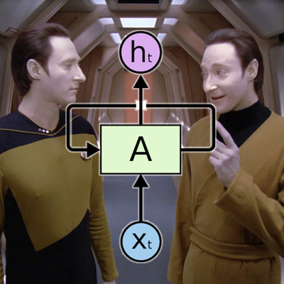

# Deep Lore



Lore is a character in the TV series [Star Trek: The Next Generation](https://en.wikipedia.org/wiki/Star_Trek:_The_Next_Generation).  This sentient android might have thought that "the reign of biological lifeforms is coming to an end" but the neural network named after him is much more benign.

Deep Lore is a python program named after this fictional android that trains and uses a neural network to generate novel episode scripts of Star Trek: The Next Generation after training on a dataset of all previous episodes.

A [recurrent neural network (RNN)](https://en.wikipedia.org/wiki/Recurrent_neural_network) is used to generate the next character in a random sequence.  When trained on highly structured text, like that found in screenplays, RNNs can be [unreasonable effective](http://karpathy.github.io/2015/05/21/rnn-effectiveness/).  Although this project was made with Star Trek in mind, this code can be used to train on any properly prepared corpus!

## Dependencies

  * [TensorFlow](https://www.tensorflow.org/)
  * [pandas](https://pandas.pydata.org/)
  * [numpy](http://www.numpy.org/)
  * [tqdm](https://github.com/tqdm/tqdm)

You can use [pip](https://pypi.python.org/pypi/pip) to install any missing dependencies.

## Basic Usage

First, a model must be trained on your dataset of interest.  Here, I've provided the transcribed scripts of every episode of Star Trek: The Next Generation.  I've also provided the most recent model currently training on this entire dataset.  This will be periodically updated as training continues.

The training file, <b>lore_train.py</b>, contains several user-editable variables that should be changed to fine tune your model.  A new model can be trained by specifying which directory contains your corpus (the CORPDIR variable) and running:

```
python lore_train.py
```

The text generating script, <b>lore.py</b>, also contains several user-editable variables. These include model and output directories as well as seed character.  The most recent model checkpoint will be used to generate text by running:

```
python lore.py
```

If the corpus that you trained on is formatted with feature extraction in mind, you'll find that text generation becomes eerily effective.  The <b>test_output</b> directory contains test text generation and statistics for every 500 checkpoints of the model currently being trained.

An output sample of this amazingly effective model follows:

```
Captain's log, stardate 44992.4. The Enterprise has been returned the right power subject to a ship. The station will be able to proceed to the Enterprise.

PICARD: The Entity is all right. The ship is all right.
WORF: The Borg ship is continuing for the ship.

[Bridge]

RIKER: The same ship's ship is still in the plan.
RO: The contained means we come to the streat, six.
PICARD: We've been able to stay a course for the Borg ship. When we could stay here to the ship.
RIKER: The shields will be a part of the planet surface.

[Engineering]

LAFORGE: I don't know.

[Bridge]

RIKER: Thank you, sir.
PICARD: The Captain has the Bridge in the Bridge.
WESLEY: That's why I can't see if I could have been able to return to the Bridge.

[Ten Forward]

RIKER: I'm sorry.

[Bridge]

PICARD: The Captain is the one this is the Commander Data and I want to be a straiget of the Enterprise that we are all right.
WORF: The entire command ships are on the ship and three hours ago.
PICARD: The ship's command.
RIKER: We are at all the same contact.
WORF: Sir, I have been in a shuttle and they are attempting to set up.
PICARD: We are at the ship.
WORF: Sir, I have been able to complete the ship's characters. It is a ship's computer system and transmitting the pattern of the shuttle is attacking.
```

## New Directions

Future plans include training on all Star Trek: The Next Generation and Star Trek: Deep Space Nine scripts to generate crossover episodes.

## Acknowledgements

This project was inspired by and conceptually based on [karpathy's](https://github.com/karpathy/char-rnn) character-level prediction model.
